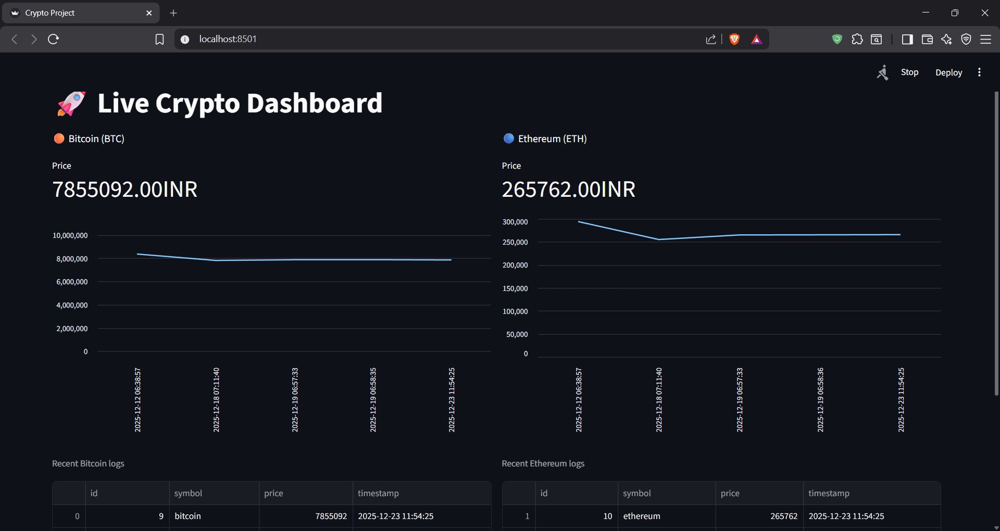

# 🚀 Real-Time Crypto Volatility Monitor

A full-stack data engineering project that monitors cryptocurrency prices in real-time, detects volatility spikes, and sends automated alerts via Telegram.

## 🏗️ Architecture
- **Ingestion:** Python script fetches live prices from CoinGecko API.
- **Storage:** SQLite database (persistent storage via Docker Volumes).
- **Visualization:** Interactive Streamlit Dashboard with split-view analytics.
- **Alerting:** Automated Telegram notifications for >2% price changes.
- **Deployment:** Fully containerized using Docker.

## 📸 Dashboard


## 🛠️ Tech Stack
- **Language:** Python 3.13
- **Containerization:** Docker & Docker Compose
- **Frontend:** Streamlit
- **Database:** SQLite
- **APIs:** CoinGecko, Telegram Bot API

## 🚀 How to Run
1. Clone the repository:
   ```bash
   git clone [https://github.com/DhruvVU/crypto-dashboard-project.git](https://github.com/DhruvVU/crypto-dashboard-project.git)